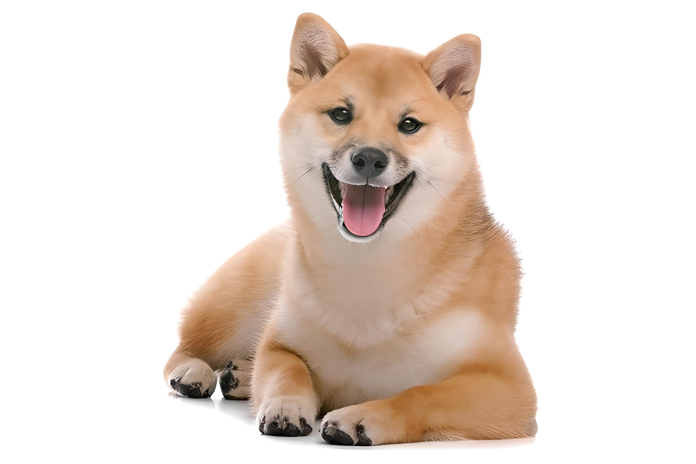

# Camera AI Demo

一個基於 Flask + Real-ESRGAN + OpenCV 的小型 Camera AI Demo，支援 超分辨率 (Super-Resolution) 與 去雜訊 (Denoise) 功能。
本專案適合作為 AI 前端應用 / Demo 展示 / 學習生成式 AI + 多媒體處理 的範例。

## 功能特色

- 超分辨率 (x4, Real-ESRGAN)：將低解析度圖片放大，增強細節。

- 去雜訊 (OpenCV)：去除圖片雜訊，讓影像更乾淨。

- Web UI (Flask)：簡單的上傳與展示介面，支援 Before/After 對照。

- CPU/GPU 皆可運行：GPU 有 CUDA 支援時效能更佳。

## 為什麼這個 Demo 用 CPU 執行？

本專案預設使用 CPU 來跑，而不是 GPU，主要原因如下：

1. 降低安裝門檻

    許多使用者環境沒有安裝 CUDA / cuDNN 或相容的顯示卡，直接用 CPU 可以避免繁瑣的 GPU 設定問題。

2. 確保通用性

    CPU 版本在任何電腦上都能運行，不需要依賴特定的硬體或驅動程式。

3. 小型 Demo 足夠

    本專案是 Demo 性質，主要展示「前後端整合」與「AI 圖像處理流程」，圖片通常較小，CPU 也能在幾秒內完成。

4. 可擴充至 GPU

    若使用者有 NVIDIA GPU，可以很容易在 inference.py 改成：
```python
device = "cuda" if torch.cuda.is_available() else "cpu"
```
就能享受 GPU 加速。

## 專案結構
```
camera_ai_demo/
│── app.py                 # Flask 主程式
│── inference.py           # Real-ESRGAN / Denoise 方法
│── requirements.txt       # 依賴套件
│── /templates/index.html  # 前端頁面
│── /uploads               # 上傳圖片存放處
│── /results               # 處理後圖片存放處
│── /weights               # 模型權重 (自動下載)
```

## 環境需求

Windows 10/11 或 Linux

Python 3.11

建議搭配 NVIDIA GPU (需 CUDA 支援)，否則會使用 CPU。

## 安裝與使用
1. Clone 專案
```bash
git clone https://github.com/你的帳號/camera_ai_demo.git
cd camera_ai_demo
```

2. 建立虛擬環境
```powershell
python -m venv .venv
.\.venv\Scripts\activate   # Windows
# source .venv/bin/activate   # Linux / macOS
```

3. 安裝套件
```powershell
python -m pip install --upgrade pip setuptools wheel

pip install flask pillow opencv-python
pip install basicsr==1.4.2 realesrgan==0.3.0 facexlib==0.3.0
pip install torch torchvision   # 安裝對應 GPU 的版本
```

4. 修正 Real-ESRGAN 與 torchvision 匯入錯誤

如果遇到：
```vbnet

ModuleNotFoundError: No module named 'torchvision.transforms.functional_tensor'
```

請編輯：
```swift
.venv/Lib/site-packages/basicsr/data/degradations.py
```

將
```python
from torchvision.transforms.functional_tensor import rgb_to_grayscale
```

改為：
```python
from torchvision.transforms.functional import rgb_to_grayscale
```

5. 建立必要資料夾
```powershell
mkdir uploads
mkdir results
```

6. 啟動伺服器
```powershell
python app.py
```

打開瀏覽器 → http://127.0.0.1:5000

## Demo 使用方式

1. 上傳一張圖片

2. 選擇處理模式：

    - 超分辨率 (Super-Resolution) → 圖片放大 x4

    - 去雜訊 (Denoise) → 圖片降噪

3. 點擊「提交」等待處理，頁面會顯示 Before/After 對照。


## 測試結果

以下為實際測試效果（CPU 執行）：

| 原圖 | 去雜訊後 | 超分辨率 (x4, Real-ESRGAN) |
|------|----------|---------------------------|
|  |  |  |

## 作者
- Name: SarikaChen 
- Email: sarika.chen0723@gmail.com  
- LinkedIn: https://www.linkedin.com/in/ling-wei-chen-542a42268/
- GitHub: https://github.com/SarikaChen